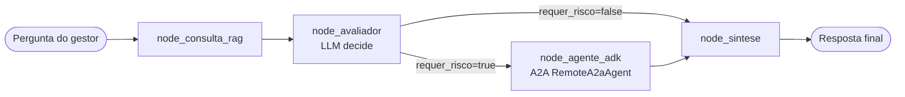

# Lab 1 — Orquestrador de Agentes: LangGraph + Vertex AI RAG + Google ADK (A2A)

**Contexto (Banco BV):** fundação de um sistema de atendimento corporativo que ajuda
gestores de conta a resolver dúvidas complexas combinando **políticas internas**
(RAG no Vertex AI Vector Search) com **delegação A2A** para agentes
especialistas (Agente de Risco Financeiro no Google ADK).

> **Quer entender multi-agentes, ADK e A2A em profundidade?**  
> Leia o [**Lab Guiado completo**](docs/LAB_GUIADO.md) (~90 min).

---

## Arquitetura



### Fluxo

| Nó | Responsabilidade |
|---|---|
| `node_consulta_rag` | Embeda a pergunta (`text-embedding-004`) e consulta o `MatchingEngineIndexEndpoint`, devolvendo os top-K trechos da política interna. |
| `node_avaliador` | Gemini com **saída estruturada Pydantic** decide se o RAG é suficiente ou se a operação exige análise de risco especializada. |
| `node_agente_adk` *(condicional)* | Orquestra uma chamada **A2A** ao Agente de Risco (ADK) via `RemoteA2aAgent`, enviando um `PayloadA2A` Pydantic com pergunta, trechos e metadados de sessão. |
| `node_sintese` | Gemini compila a resposta final, citando a política interna `[n]` e, se houver, o parecer do especialista. |

---

## Destaques técnicos

- **Pydantic em toda a borda**: `OrchestratorState`, `DocumentoRAG`, `AvaliacaoRisco`, `PayloadA2A` — tipagem forte de ponta a ponta.
- **`pydantic-settings`** para configuração validada a partir do `.env` (URLs, ranges, enums).
- **Logging estruturado** por módulo (`src/logging_config.py`), nível configurável via `LOG_LEVEL`.
- **Enum `Node`** elimina strings mágicas no grafo.
- **Graceful degradation**: falha na chamada A2A vira mensagem de indisponibilidade na síntese, sem quebrar o fluxo.
- **Streaming** com `--verbose`: trilha de execução por nó.

---

## Estrutura do projeto

```
agente-6-langgraph-adk/
├── .env.example
├── .gitignore
├── README.md
├── requirements.txt
├── main.py
├── docs/
│   └── LAB_GUIADO.md           # material didático (multi-agentes, ADK, A2A)
└── src/
    ├── __init__.py
    ├── config.py               # Pydantic-Settings
    ├── constants.py            # Enum de nós
    ├── logging_config.py       # logging
    ├── state.py                # OrchestratorState (BaseModel)
    ├── models.py               # AvaliacaoRisco, PayloadA2A, SessaoA2A
    ├── graph.py                # StateGraph + edges condicionais
    ├── clients/
    │   ├── vertex_rag.py       # Vector Search + embeddings
    │   ├── adk_a2a.py          # RemoteA2aAgent (Agent Client)
    │   └── llm.py              # ChatVertexAI (Gemini)
    └── nodes/
        ├── consulta_rag.py
        ├── avaliador.py
        ├── router.py
        ├── agente_adk.py
        └── sintese.py
```

---

## Pré-requisitos

1. **Python 3.11+**
2. **Credenciais GCP** com permissões de Vertex AI (Vector Search + Gemini).
3. **Vertex AI Vector Search** já provisionado: `Index ID`, `Index Endpoint ID`, `Deployed Index ID`.
4. **Agente de Risco** publicado no **Google ADK** com A2A habilitado (expõe `/.well-known/agent.json`).

---

## Instalação e configuração

```bash
python -m venv .venv
source .venv/bin/activate           # Windows: .venv\Scripts\activate
pip install -r requirements.txt

cp .env.example .env                # edite com seus IDs e URLs
gcloud auth application-default login
```

---

## Execução

```bash
# Chamada única
python main.py --pergunta "Posso aprovar R$ 10M de capital de giro para cliente Corporate com rating B?"

# Com trilha de execução (delta por nó)
python main.py -p "Como calcular provisão IFRS 9?" --verbose

# Modo interativo
python main.py
```

Se alguma variável obrigatória do `.env` faltar, o CLI imprime um
`ValidationError` do Pydantic indicando exatamente o campo faltante e
retorna com código 2.

---

## O Protocolo A2A (Agent-to-Agent)

No paradigma **A2A**, o Orquestrador (LangGraph) atua como **Agent
Client** e invoca um **Agent Server** remoto (o Agente de Risco do ADK)
via o _Agent Card_ publicado em `/.well-known/agent.json`.

Neste projeto a integração é feita pelo `RemoteA2aAgent` do
`google-adk[a2a]` (ver [`src/clients/adk_a2a.py`](src/clients/adk_a2a.py)).
O payload enviado é um `PayloadA2A` Pydantic serializado em JSON:

```json
{
  "intent": "avaliar_risco_credito",
  "pergunta": "...",
  "trechos_politica": [
    {"id": "...", "distance": 0.12, "texto": "...", "metadata": {}}
  ],
  "sessao": {
    "orquestrador": "bv_langgraph",
    "trace_id": "...",
    "justificativa_triagem": "..."
  }
}
```

---

## Variáveis de ambiente

| Variável | Descrição |
|---|---|
| `GOOGLE_CLOUD_PROJECT` | ID do projeto GCP. |
| `GOOGLE_CLOUD_LOCATION` | Região (ex.: `us-central1`). |
| `GOOGLE_APPLICATION_CREDENTIALS` | Caminho opcional para JSON da service account. |
| `VECTOR_SEARCH_INDEX_NAME` | Resource name completo do índice (`projects/<num>/locations/<loc>/indexes/<id>`). |
| `VECTOR_SEARCH_INDEX_ENDPOINT_NAME` | Resource name completo do Index Endpoint (`projects/<num>/locations/<loc>/indexEndpoints/<id>`). |
| `VECTOR_SEARCH_DEPLOYED_INDEX_ID` | ID do deployed index. |
| `GOOGLE_CLOUD_STORAGE_BUCKET` | (Opcional) Bucket GCS de staging para datapoints/RAG. |
| `VERTEX_EMBEDDING_MODEL` | Modelo de embedding (default: `text-embedding-004`). |
| `VERTEX_RAG_TOP_K` | Nº de vizinhos (default: `5`). |
| `VERTEX_LLM_MODEL` | Modelo Gemini (default: `gemini-2.5-flash`). |
| `VERTEX_LLM_TEMPERATURE` | Temperatura do LLM (default: `0.2`). |
| `ADK_RISK_AGENT_CARD_URL` | URL do agent card do Agente de Risco. |
| `ADK_RISK_AGENT_TIMEOUT` | Timeout (segundos) da chamada A2A. |
| `LOG_LEVEL` | `DEBUG` / `INFO` / `WARNING` / `ERROR` / `CRITICAL`. |

---

## Próximos passos (Labs seguintes)

- Publicar o **Agente de Risco** no ADK e expô-lo via A2A (`to_a2a()`).
- Adicionar **persistência** (Checkpointer do LangGraph) para conversas longas.
- Avaliação (traces e evals) do orquestrador.
- Novos especialistas A2A (Compliance, Jurídico, Cadastro) em paralelo.

Consulte o [**Lab Guiado**](docs/LAB_GUIADO.md) para exercícios de
aprofundamento e extensões.
