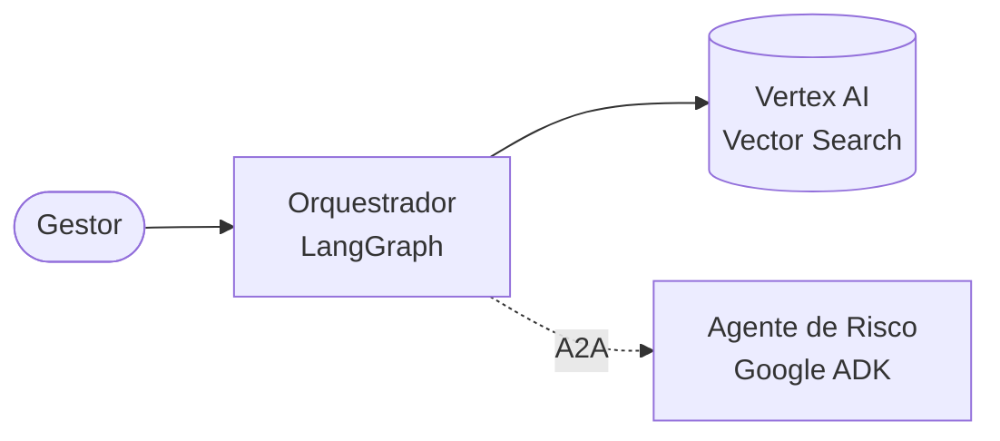
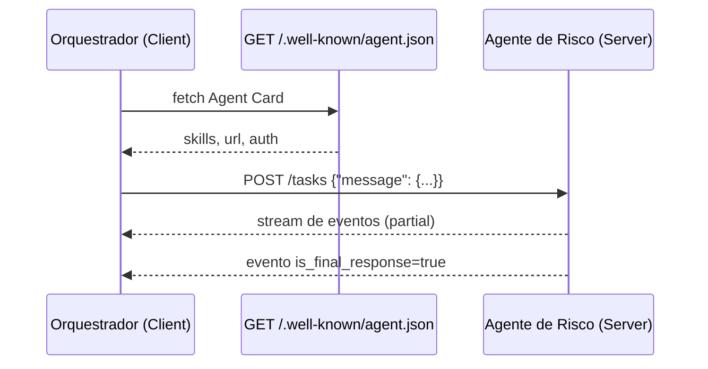
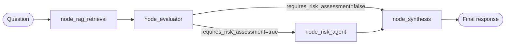

# Lab Guiado — Orquestração Multi-Agente com LangGraph + Vertex AI RAG + Google ADK (A2A)

> Material didático para engenheiros do Banco.  
> Duração estimada: **~90 minutos** de leitura + hands-on.

---

## Sumário

1. [Problema de negócio](#1-problema-de-negócio)
2. [O que são Sistemas Multi-Agentes?](#2-o-que-são-sistemas-multi-agentes)
3. [Google ADK — Agent Development Kit](#3-google-adk--agent-development-kit)
4. [Protocolo A2A — Agent-to-Agent](#4-protocolo-a2a--agent-to-agent)
5. [Por que LangGraph como orquestrador?](#5-por-que-langgraph-como-orquestrador)
6. [Arquitetura do nosso Orquestrador](#6-arquitetura-do-nosso-orquestrador)
7. [Walkthrough do código (passo a passo)](#7-walkthrough-do-código-passo-a-passo)
8. [Exercícios e extensões](#8-exercícios-e-extensões)
9. [Troubleshooting](#9-troubleshooting)

---

## 1. Problema de negócio

Gestores de conta do Banco precisam responder rapidamente a dúvidas
complexas: "Posso aprovar R$ 10M de capital de giro para um cliente
_Corporate_ com rating B?", "Como aplicar a Resolução 4.966 nessa
reestruturação?", etc.

Essas dúvidas envolvem **dois tipos de conhecimento**:

- **Conhecimento factual**: políticas internas, manuais, limites operacionais.  
  → RAG sobre **Vertex AI Vector Search**.
- **Conhecimento especializado**: análise de risco, IFRS 9, covenants, exposição.  
  → Agente especialista dedicado, rodando no **Google ADK**.

O **Orquestrador** é quem decide, a cada pergunta, se o RAG basta ou se
precisa acionar o especialista — e compõe a resposta final.

---

## 2. O que são Sistemas Multi-Agentes?

Um **agente** é um componente de software que **percebe** (entrada),
**decide** (raciocínio) e **age** (chamada de ferramenta / resposta) de
forma autônoma dentro de um escopo.

Um **sistema multi-agente (MAS)** é um conjunto de agentes que colaboram
para resolver problemas maiores do que qualquer um deles resolveria
isoladamente.

### Por que não usar um único agente gigante?

| Problema do agente único                   | Solução multi-agente                         |
| ------------------------------------------ | -------------------------------------------- |
| Prompt gigantesco e frágil                 | Cada agente tem prompt e ferramentas focadas |
| Difícil testar e evoluir                   | Agentes testáveis independentemente          |
| Custo alto (tokens) por não rotear         | Rota o trabalho só para quem precisa         |
| Mistura de domínios (crédito, jurídico...) | Cada especialista é dono de um domínio       |

### Padrões comuns

- **Router / Orchestrator**: um "chefe" decide quem executa o quê.  
  _É o padrão usado neste lab._
- **Blackboard**: agentes escrevem em um estado comum e reagem.
- **Hierárquico**: agentes com sub-agentes (árvore).
- **Negociação / debate**: agentes trocam mensagens até chegar a consenso.

### No nosso lab



O Orquestrador é o **Agent Client**.  
O Agente de Risco é um **Agent Server** remoto (em outro processo, Cloud Run, etc.).

---

## 3. Google ADK — Agent Development Kit

**Google ADK** ([docs oficiais](https://google.github.io/adk-docs/)) é
um SDK open-source para **construir, testar e publicar agentes**
compatíveis com o ecossistema Google Cloud (Vertex AI + Gemini + Agent Engine).

### Conceitos-chave do ADK

| Conceito                  | O que é                                                                        |
| ------------------------- | ------------------------------------------------------------------------------ |
| `Agent`                   | Definição declarativa do agente: instruções, modelo, ferramentas, sub-agentes. |
| `Runner`                  | Motor que executa um agente dentro de uma sessão.                              |
| `SessionService`          | Armazena o histórico de sessões (memória).                                     |
| `Tool`                    | Função Python que o agente pode chamar (ex.: consultar CRM).                   |
| `agent.json` / Agent Card | Documento A2A que descreve um agente publicamente.                             |
| `to_a2a()`                | Converte um agente ADK em um servidor A2A (uvicorn).                           |
| `RemoteA2aAgent`          | Consome um agente A2A remoto como se fosse local.                              |

### Duas posições no protocolo

1. **Expor** (Agent Server): você tem um agente e o publica.

```python
from google.adk.agents import LlmAgent
from google.adk.a2a import to_a2a

agent = LlmAgent(name="risk_specialist", model="gemini-2.5-flash", ...)
a2a_app = to_a2a(agent)  # ASGI app para uvicorn
```

2. **Consumir** (Agent Client): você chama um agente remoto.

```python
from google.adk.agents.remote_a2a_agent import RemoteA2aAgent

remote = RemoteA2aAgent(
    name="risk_specialist",
    agent_card="https://.../.well-known/agent.json",
)
```

**Neste lab somos o Client.** O servidor já existe (ou será construído num lab seguinte).

---

## 4. Protocolo A2A — Agent-to-Agent

**A2A** ([a2a-protocol.org](https://a2a-protocol.org)) é um protocolo aberto
(Google + parceiros) que padroniza a conversa **entre agentes**, assim como
HTTP padroniza a conversa entre clientes e servidores web.

### Por que A2A e não só REST?

REST tradicional troca **dados**.  
A2A troca **intenções, contexto e tarefas** entre agentes — com:

- **Agent Card** (`/.well-known/agent.json`): descreve habilidades, skills, auth, input/output schema.
- **Sessions** e **Tasks**: conversas longas, streaming, estado.
- **Messages** com `Parts` (texto, arquivo, data JSON).
- **Segurança**: OAuth / API key / mTLS declarados no card.
- **Descoberta**: um agente pode listar outros agentes disponíveis.

### Fluxo simplificado



### Payload que nosso Orquestrador envia

Em vez de mandar só texto cru, estruturamos a intenção num envelope
Pydantic (`src/models.py` — classe `A2APayload`):

```json
{
  "intent": "assess_credit_risk",
  "question": "Can I approve R$10M working capital for client X?",
  "policy_chunks": [
    { "id": "pol-123", "distance": 0.12, "text": "...", "metadata": {} }
  ],
  "session": {
    "orchestrator": "bv_langgraph",
    "trace_id": "a1b2c3...",
    "triage_rationale": "amount exceeds standard limits"
  }
}
```

Esse envelope vira o `text` de um `Part` enviado ao `RemoteA2aAgent`.

---

## 5. Por que LangGraph como orquestrador?

Poderíamos fazer a orquestração com um `if/else` em Python. Por que LangGraph?

| Recurso                  | Ganho no Banco                                     |
| ------------------------ | -------------------------------------------------- |
| **StateGraph tipado**    | Fluxo explícito, auditável, testável.              |
| **Edges condicionais**   | Rotear por decisão do LLM (avaliador).             |
| **Streaming**            | Mostrar progresso ao gestor (`--verbose`).         |
| **Checkpointer**         | Retomar conversas longas (próximos labs).          |
| **Integração LangChain** | `ChatVertexAI`, `with_structured_output`, prompts. |
| **Observabilidade**      | Traces/eventos por nó (LangSmith opcional).        |

Alternativa: o próprio ADK já orquestra agentes com `SequentialAgent` e
`ParallelAgent`. Decisão do lab: **LangGraph** por ser neutro e flexível
para fluxos arbitrários (loops, paralelismo, human-in-the-loop).

---

## 6. Arquitetura do nosso Orquestrador

### Grafo



### Estado compartilhado (`src/state.py`)

```python
class OrchestratorState(BaseModel):
    question: str                              # pergunta original do gestor
    rag_context: list[RAGDocument] = []        # docs do Vector Search
    requires_risk_assessment: bool = False     # decisão do avaliador
    evaluator_rationale: str = ""              # justificativa da decisão
    risk_assessment_response: Optional[str] = None  # parecer do ADK
    final_response: str = ""                   # resposta final ao gestor
```

Cada nó recebe o estado tipado e retorna um **dict parcial** — o
LangGraph mescla automaticamente no estado global antes de chamar o próximo nó.

### Camadas do projeto

```
main.py                      CLI
└── src/graph.py             StateGraph + edges condicionais
    ├── src/nodes/           Lógica dos 4 nós + router
    ├── src/clients/         I/O externo (Vector Search, LLM, ADK A2A)
    ├── src/models.py        Pydantic: RiskAssessment, A2APayload, PolicyChunk
    ├── src/state.py         Pydantic: OrchestratorState, RAGDocument
    ├── src/config.py        Pydantic-Settings: leitura e validação do .env
    ├── src/constants.py     Enum Node (nomes dos nós)
    └── src/logging_config.py
```

**Princípios:**

- Um módulo = uma responsabilidade.
- Nós não falam com SDKs diretamente — usam `clients/`.
- Toda troca estruturada é **Pydantic** (estado, avaliação, payload A2A).
- Configuração **declarativa e validada** (Pydantic-Settings).

---

## 7. Walkthrough do código (passo a passo)

> Dica: abra cada arquivo em paralelo à leitura.

### Passo 0 — Preparação

```bash
python -m venv .venv && source .venv/bin/activate   # Linux/Mac
# .venv\Scripts\activate                             # Windows
pip install -r requirements.txt
cp .env.example .env   # edite com seus IDs
gcloud auth application-default login
```

### Passo 1 — Configuração tipada (`src/config.py`)

Lemos o `.env` com `pydantic-settings`. Toda variável obrigatória que
faltar gera um `ValidationError` com mensagem clara — antes de qualquer
chamada ao Vertex AI.

```python
class Settings(BaseSettings):
    model_config = SettingsConfigDict(env_file=".env", extra="ignore")
    google_cloud_project: str               # obrigatório — sem default
    vertex_embedding_model: str = "text-embedding-004"
    adk_risk_agent_card_url: HttpUrl        # URL é validada pelo Pydantic
    ...
```

Por que isto é importante no Banco?

- **Falhar cedo**: erro de config detectado no `get_settings()`, não no meio de uma chamada ao Vertex.
- **Auditável**: o modelo é auto-documentado — basta ler a classe.
- **Testável**: você pode instanciar `Settings(google_cloud_project="x", ...)` em testes sem .env.

### Passo 2 — Estado e modelos (`src/state.py`, `src/models.py`)

Ter os modelos tipados significa que:

- O avaliador sempre devolve `RiskAssessment` (nunca um JSON quebrado).
- O payload A2A é `A2APayload` — se o Agente Especialista mudar o
  schema, a falha aparece em um ponto único.

**Exercício mental:** se amanhã você quiser adicionar o campo
`client_segment: Optional[str]` no payload A2A, onde você mexe? → Apenas em
`src/models.py`. O resto continua compilando.

### Passo 3 — Clients

#### `src/clients/vector_search.py`

```python
def search_policies(question: str) -> list[RAGDocument]:
    embedding = embed_query(question)        # text-embedding-004
    matches = endpoint.find_neighbors(
        deployed_index_id=settings.vector_search_deployed_index_id,
        queries=[embedding],
        num_neighbors=k,
    )
    return [RAGDocument(...) for n in matches[0]]
```

Convenção do lab: o texto do trecho é guardado em `restricts` com
`namespace="texto"`. Em produção, você pode preferir um _metadata store_
externo (Firestore, GCS) — basta substituir `_extract_text_and_metadata`.

#### `src/clients/adk_client.py`

1. `RemoteA2aAgent(agent_card=URL)` faz o _fetch_ do Agent Card.
2. `InMemoryRunner(agent=...)` cria um runner com sessão em memória.
3. `runner.run_async(...)` dispara a tarefa A2A.
4. Coletamos só o evento **final** (`event.is_final_response()`).
5. Timeout e exceções viram `A2AClientError`.

Note a serialização — `A2APayload` (Pydantic) → JSON → `types.Part`:

```python
message_text = payload.model_dump_json(indent=2)  # A2APayload → JSON string
message = types.Content(role="user", parts=[types.Part(text=message_text)])
```

### Passo 4 — Nós

#### `node_rag_retrieval` — `src/nodes/rag_retrieval.py`

Simplesmente delega para o client:

```python
def node_rag_retrieval(state: OrchestratorState) -> dict:
    documents = search_policies(state.question)
    return {"rag_context": documents}
```

#### `node_evaluator` — `src/nodes/evaluator.py` — **a peça central da orquestração**

Usa `with_structured_output(RiskAssessment)` para forçar o Gemini a
devolver um objeto Pydantic válido (sem parse manual de JSON):

```python
chain = prompt | get_llm().with_structured_output(RiskAssessment)
result: RiskAssessment = chain.invoke({...})
return {
    "requires_risk_assessment": result.requires_escalation,
    "evaluator_rationale": result.rationale,
}
```

Os critérios de escalonamento estão no `_SYSTEM_PROMPT` — é o **policy brain**
do orquestrador. Ajuste conforme a mesa de crédito do Banco evolui.

#### `route_after_evaluation` — `src/nodes/router.py`

Uma função pura, sem I/O, trivial de testar unitariamente:

```python
def route_after_evaluation(state: OrchestratorState) -> Node:
    return Node.RISK_AGENT if state.requires_risk_assessment else Node.SYNTHESIS
```

#### `node_risk_agent` (condicional) — `src/nodes/risk_agent.py`

Monta o `A2APayload` e chama o client:

```python
payload = A2APayload(
    question=state.question,
    policy_chunks=[PolicyChunk.from_document(d) for d in state.rag_context],
    session=A2ASession(trace_id=uuid.uuid4().hex, ...),
)
assessment = query_risk_agent(payload)
```

**Graceful degradation**: se o A2A falhar, o fluxo **não quebra** — o
`risk_assessment_response` vira uma mensagem de indisponibilidade e o nó
de síntese alerta o gestor.

#### `node_synthesis` — `src/nodes/synthesis.py`

Combina `rag_context` + `risk_assessment_response` (quando presente) e
devolve texto final com citações numeradas `[n]`.

### Passo 5 — O grafo (`src/graph.py`)

```python
g = StateGraph(OrchestratorState)
g.add_node(Node.RAG_RETRIEVAL, node_rag_retrieval)
g.add_node(Node.EVALUATOR,     node_evaluator)
g.add_node(Node.RISK_AGENT,    node_risk_agent)
g.add_node(Node.SYNTHESIS,     node_synthesis)

g.set_entry_point(Node.RAG_RETRIEVAL)
g.add_edge(Node.RAG_RETRIEVAL, Node.EVALUATOR)
g.add_conditional_edges(Node.EVALUATOR, route_after_evaluation, {
    Node.RISK_AGENT: Node.RISK_AGENT,
    Node.SYNTHESIS:  Node.SYNTHESIS,
})
g.add_edge(Node.RISK_AGENT, Node.SYNTHESIS)
g.add_edge(Node.SYNTHESIS, END)

app = g.compile()
```

Os `Node.*` (enum `StrEnum`) eliminam _strings mágicas_ espalhadas pelo código.
Um typo vira `AttributeError` em vez de rotear silenciosamente para um nó inexistente.

### Passo 6 — Executando

```bash
# Chamada simples
python main.py -q "Can I approve R$10M working capital for a Corporate client with rating B?"

# Com trilha de execução (imprime delta de estado por nó)
python main.py -q "What is the covenant policy?" --verbose

# Modo interativo
python main.py
```

---

## 8. Exercícios e extensões

### Nível 1 — Entendimento

1. Rode com `LOG_LEVEL=DEBUG` no `.env` e observe cada etapa do
   Vector Search e da chamada A2A nos logs.
2. Ajuste `VERTEX_RAG_TOP_K` para 3 e para 10. O comportamento do
   avaliador muda? Por quê?
3. Mude `VERTEX_LLM_TEMPERATURE` para `0.8` e execute a mesma pergunta
   várias vezes. A decisão `requires_risk_assessment` é estável?

### Nível 2 — Código

4. Adicione o campo `client_segment: Optional[str]` em
   `OrchestratorState` e propague-o até `A2APayload` para que o agente
   de risco receba o segmento do cliente.
5. Substitua o `InMemoryRunner` por um runner com persistência
   (ex.: Firestore) — dica: `RunnerConfig`/`SessionService` do ADK.
6. O teste `test_router.py` já cobre `route_after_evaluation`. Adicione
   um teste que verifique que o valor retornado é exatamente um dos
   dois `Node` mapeados no `add_conditional_edges`.

### Nível 3 — Arquitetura

7. Adicione um **segundo especialista A2A** (Compliance) e transforme
   `requires_risk_assessment` em `required_specialists: list[str]` para
   executar os dois agentes em paralelo com `add_node` + `Send()`.
8. Adicione um _checkpointer_ do LangGraph (`MemorySaver` ou
   `SqliteSaver`) para suportar conversas multi-turn com o mesmo gestor.
9. Instrumente OpenTelemetry no orquestrador e no agente ADK e
   visualize o trace completo no Cloud Trace.

---

## 9. Troubleshooting

| Sintoma                               | Causa provável                                                 | Solução                                                                            |
| ------------------------------------- | -------------------------------------------------------------- | ---------------------------------------------------------------------------------- |
| `ValidationError` em `get_settings()` | Variável obrigatória ausente no `.env`                         | Preencher `.env` seguindo `.env.example`.                                          |
| `DefaultCredentialsError`             | ADC não configurado                                            | `gcloud auth application-default login` ou setar `GOOGLE_APPLICATION_CREDENTIALS`. |
| `find_neighbors` retorna lista vazia  | Índice não populado / `VECTOR_SEARCH_DEPLOYED_INDEX_ID` errado | Confirmar `gcloud ai index-endpoints describe ...`.                                |
| A2A timeout                           | Agent Server lento / offline                                   | Subir `ADK_RISK_AGENT_TIMEOUT` ou verificar health do servidor.                    |
| `ModuleNotFoundError: google.adk`     | Pacote sem extras A2A                                          | `pip install 'google-adk[a2a]'`.                                                   |
| `with_structured_output` falha        | Modelo não suporta tool-calling                                | Usar `gemini-2.5-flash` ou `gemini-2.5-pro`.                                       |

---

## Referências

- [LangGraph docs](https://langchain-ai.github.io/langgraph/)
- [Google ADK — Python](https://google.github.io/adk-docs/)
- [A2A Protocol](https://a2a-protocol.org)
- [Vertex AI Vector Search](https://cloud.google.com/vertex-ai/docs/vector-search/overview)
- [Gemini API](https://ai.google.dev/)
