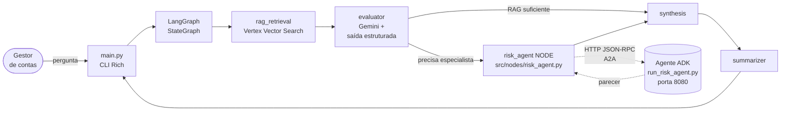

# Lab Guiado — Google A2A (Agent-to-Agent) na prática

> **Objetivo deste lab:** entender, linha a linha, como o Agente Especialista de Risco deste projeto é exposto via **Google ADK** como um servidor **A2A**, e como o **Orquestrador LangGraph** o descobre, chama e consome — usando somente o protocolo A2A.
>
> **Público-alvo:** alunos que já instalaram o projeto (ver `docs/SETUP.md`) e querem entender, na prática, o ciclo completo cliente ↔ servidor do protocolo A2A.
>
> **Duração sugerida:** 60–90 minutos (leitura + execução).

---

## Sumário

1. [O que é A2A e por que ele existe](#1-o-que-é-a2a-e-por-que-ele-existe)
2. [Visão geral da arquitetura do lab](#2-visão-geral-da-arquitetura-do-lab)
3. [Contrato A2A: o Agent Card e o JSON‑RPC](#3-contrato-a2a-o-agent-card-e-o-json-rpc)
4. [Arquivos, na ordem que vamos estudar](#4-arquivos-na-ordem-que-vamos-estudar)
5. [Parte A — O Agente (servidor A2A)](#parte-a--o-agente-servidor-a2a)
   - [A1. `risk_agent/__init__.py` — o que o ADK procura](#a1-risk_agent__init__py--o-que-o-adk-procura)
   - [A2. `risk_agent/agent.py` — o `root_agent` (LlmAgent)](#a2-risk_agentagentpy--o-root_agent-llmagent)
   - [A3. `risk_agent/tools.py` — ferramentas do especialista](#a3-risk_agenttoolspy--ferramentas-do-especialista)
   - [A4. `risk_agent/agent.json` — o Agent Card](#a4-risk_agentagentjson--o-agent-card)
   - [A5. `run_risk_agent.py` — subindo o servidor A2A](#a5-run_risk_agentpy--subindo-o-servidor-a2a)
6. [Parte B — O Orquestrador (cliente A2A)](#parte-b--o-orquestrador-cliente-a2a)
   - [B1. `.env` / `.env.example` — onde está o Agent Card](#b1-env--envexample--onde-está-o-agent-card)
   - [B2. `src/models.py` — o envelope `A2APayload`](#b2-srcmodelspy--o-envelope-a2apayload)
   - [B3. `src/clients/adk_client.py` — `RemoteA2aAgent` + `InMemoryRunner`](#b3-srcclientsadk_clientpy--remotea2aagent--inmemoryrunner)
   - [B4. `src/nodes/evaluator.py` + `src/nodes/router.py` — quem decide chamar](#b4-srcnodesevaluatorpy--srcnodesrouterpy--quem-decide-chamar)
   - [B5. `src/nodes/risk_agent.py` — o nó que dispara o A2A](#b5-srcnodesrisk_agentpy--o-nó-que-dispara-o-a2a)
   - [B6. `src/graph.py` — onde o nó entra no grafo](#b6-srcgraphpy--onde-o-nó-entra-no-grafo)
   - [B7. `main.py` — o CLI que fecha o ciclo](#b7-mainpy--o-cli-que-fecha-o-ciclo)
7. [Parte C — Rodando tudo localmente (passo a passo)](#parte-c--rodando-tudo-localmente-passo-a-passo)
8. [Parte D — Inspecionando a rede: Agent Card e JSON‑RPC no navegador / curl](#parte-d--inspecionando-a-rede-agent-card-e-json-rpc-no-navegador--curl)
9. [Troubleshooting](#9-troubleshooting)
10. [Checklist mental do aluno](#10-checklist-mental-do-aluno)

---

## 1. O que é A2A e por que ele existe

### 1.1 O problema

Hoje é comum termos **vários agentes de LLM** feitos em frameworks diferentes (LangGraph, ADK, LlamaIndex, CrewAI...). Cada um tem sua própria API interna. Integrá-los costuma virar um "`if framework == 'langchain': ... else if framework == 'adk': ...`".

O **A2A (Agent-to-Agent)** é um **protocolo aberto** criado para resolver isso. Ele diz:

> "Se você quer que outros agentes te chamem, **exponha um endpoint HTTP + JSON-RPC** e **publique um 'Agent Card'** num caminho-padrão. Qualquer cliente A2A saberá te chamar, independentemente do framework."

### 1.2 Os três conceitos que você precisa reter

| Conceito | O que é | Onde mora no nosso projeto |
|---|---|---|
| **Agent Card** | JSON público com nome, URL, skills e transport (HTTP/JSON-RPC). É o "cardápio" do agente. | [`risk_agent/agent.json`](risk_agent/agent.json) (e servido em `/.well-known/agent-card.json`) |
| **Agent Server** | Quem recebe as chamadas. Expõe `/a2a/<agent>` (JSON-RPC) e o `.well-known/agent-card.json`. | [`run_risk_agent.py`](run_risk_agent.py) + a pasta [`risk_agent/`](risk_agent/) |
| **Agent Client** | Quem faz a chamada. Lê o Agent Card, abre sessão, manda mensagens, escuta o fluxo de eventos. | [`src/clients/adk_client.py`](src/clients/adk_client.py) (`RemoteA2aAgent`) |

### 1.3 A grande vantagem

O orquestrador **não importa o código** do risk agent. Ele só conhece uma **URL** (o Agent Card). Amanhã o especialista pode:

- ser reescrito em outro framework,
- ser publicado em Cloud Run / Kubernetes,
- ser trocado por outro agente equivalente…

…e o orquestrador continua funcionando **sem mudar uma linha de código**. Só muda `ADK_RISK_AGENT_CARD_URL` no `.env`.

---

## 2. Visão geral da arquitetura do lab



**Duas coisas rodam em processos/portas diferentes:**

1. **Servidor A2A** — sobe com `python run_risk_agent.py` e escuta em `127.0.0.1:8080`.
2. **Orquestrador** — sobe com `python main.py` no seu terminal, chama o servidor via HTTP.

É **exatamente isso** que A2A resolve: desacoplar esses dois processos.

---

## 3. Contrato A2A: o Agent Card e o JSON‑RPC

O A2A tem dois tipos de chamadas:

### 3.1 Discovery (descoberta)

```
GET http://<host>/a2a/<agent_name>/.well-known/agent-card.json
```

Retorna o Agent Card (nome, URL, skills, versão do protocolo, transport). O cliente **sempre** faz isso primeiro.

### 3.2 Invocation (invocação)

```
POST http://<host>/a2a/<agent_name>
Content-Type: application/json

{
  "jsonrpc": "2.0",
  "id": "1",
  "method": "message/stream",
  "params": { "message": { "role": "user", "parts": [ ... ] } }
}
```

JSON-RPC padrão. Retorna um **stream de eventos** (tool calls, partial outputs, final response).

Nós não vamos escrever esses payloads na mão. O `RemoteA2aAgent` do ADK cuida disso. Mas é importante saber que **por baixo é isto aqui**, porque o lab vai inspecionar esses endpoints com `curl`.

---

## 4. Arquivos, na ordem que vamos estudar

Leia nesta ordem — é exatamente o sentido do tráfego A2A, do **servidor ao cliente**:

### Servidor A2A (expõe o especialista)

1. [`risk_agent/__init__.py`](risk_agent/__init__.py)
2. [`risk_agent/agent.py`](risk_agent/agent.py)
3. [`risk_agent/tools.py`](risk_agent/tools.py)
4. [`risk_agent/agent.json`](risk_agent/agent.json)
5. [`run_risk_agent.py`](run_risk_agent.py)

### Cliente A2A (consome o especialista via HTTP)

6. [`.env`](.env) e [`.env.example`](.env.example)
7. [`src/models.py`](src/models.py)
8. [`src/clients/adk_client.py`](src/clients/adk_client.py)
9. [`src/nodes/evaluator.py`](src/nodes/evaluator.py) + [`src/nodes/router.py`](src/nodes/router.py)
10. [`src/nodes/risk_agent.py`](src/nodes/risk_agent.py)
11. [`src/graph.py`](src/graph.py)
12. [`main.py`](main.py)

---

## Parte A — O Agente (servidor A2A)

### A1. `risk_agent/__init__.py` — o que o ADK procura

```1:17:risk_agent/__init__.py
"""Risk Specialist Agent — Google ADK A2A server.

Run with:
    python run_risk_agent.py          # starts on port 8080

The ADK agent loader (google.adk.cli.fast_api) discovers agents by importing
each subfolder under `agents_dir` as a package and looking up `root_agent`.
Re-exporting it here makes the agent discoverable without forcing the loader
to inspect agent.py directly.

Agent Card:
    http://127.0.0.1:8080/a2a/risk_agent/.well-known/agent-card.json
"""

from .agent import root_agent

__all__ = ["root_agent"]
```

**Leitura didática:**

- O ADK (`google.adk.cli.fast_api.get_fast_api_app`) recebe um diretório (`agents_dir=".") e **varre todas as subpastas** procurando por pacotes Python que exportem uma variável chamada **`root_agent`**.
- Por isso o `__init__.py` **reexporta** `root_agent`. Se faltar esta linha, o agente **não é descoberto** e o endpoint A2A nem sequer é criado.
- O nome da **pasta** (`risk_agent`) vira o **path** do endpoint A2A: `/a2a/risk_agent/...`. Se você renomear a pasta, muda o endpoint (e precisa atualizar o Agent Card e o `.env`).

> **Regra de ouro #1:** em ADK, um agente A2A = 1 pasta + `__init__.py` reexportando `root_agent` + `agent.py` definindo-o.

---

### A2. `risk_agent/agent.py` — o `root_agent` (LlmAgent)

```1:86:risk_agent/agent.py
"""Risk Specialist Agent definition for Google ADK.

This module defines `root_agent` — the required entry point for ADK's
api_server / get_fast_api_app loader.
...
"""

from __future__ import annotations

from google.adk.agents import LlmAgent

from .tools import check_regulatory_thresholds, search_credit_policies

_INSTRUCTION = """Você é o Agente Especialista de Risco de Crédito do Banco BV.

Você recebe mensagens do Orquestrador LangGraph no seguinte formato JSON:
  {
    "intent": "assess_credit_risk",
    "question": "<pergunta original do gestor de contas>",
    "policy_chunks": [{"id": "...", "distance": <float>, "text": "<trecho>"}],
    "session": {"orchestrator": "bv_langgraph", "trace_id": "<id>", "triage_rationale": "<motivo>"}
  }

Seu fluxo de trabalho obrigatório:
1. Leia o campo "question" e "triage_rationale" para entender o contexto.
2. Avalie os "policy_chunks" fornecidos — eles são o contexto RAG inicial.
3. Se necessário, use a ferramenta search_credit_policies para buscar trechos
   adicionais de política específicos ao risco identificado.
4. Use check_regulatory_thresholds para verificar alçadas e requisitos de provisão
   quando houver valor financeiro mencionado ou tipo de operação identificável.
5. Elabore um Parecer Técnico de Risco estruturado com as seções abaixo.
...
"""

root_agent = LlmAgent(
    name="risk_specialist_bv",
    model="gemini-2.5-flash",
    description=(
        "Agente Especialista de Risco de Crédito do Banco BV. "
        "Analisa operações de crédito complexas usando políticas internas (RAG) "
        "e frameworks regulatórios (IFRS 9, Res. BCB 4.966). "
        "Chamado via A2A pelo orquestrador LangGraph quando o avaliador "
        "detecta necessidade de análise especializada."
    ),
    instruction=_INSTRUCTION,
    tools=[search_credit_policies, check_regulatory_thresholds],
)
```

**Leitura didática:**

- `LlmAgent` é o **bloco básico** do ADK. Ele junta quatro coisas:
  1. **`name`** (`risk_specialist_bv`) — identidade interna.
  2. **`model`** (`gemini-2.5-flash`) — o motor. Aqui estamos usando Vertex AI (ver `GOOGLE_GENAI_USE_VERTEXAI=TRUE` no `.env`).
  3. **`instruction`** — o **system prompt** do especialista. Repare que ele **descreve o contrato A2A** que vai receber: o agente sabe que chegará um JSON com `intent`, `question`, `policy_chunks` e `session`.
  4. **`tools`** — funções Python (veremos em A3). O ADK transforma cada função com type hints + docstring em um `FunctionTool` automaticamente.
- **Não há código de rede aqui.** Este arquivo é "só o agente". Quem o transforma em servidor HTTP é o `run_risk_agent.py` (A5).

> **Por que isso é importante para A2A?** Porque o `LlmAgent` define o **comportamento** que o orquestrador vai consumir — mas o agente **não precisa saber** que está atrás de um endpoint A2A. O framework cuida disso.

---

### A3. `risk_agent/tools.py` — ferramentas do especialista

```1:30:risk_agent/tools.py
"""Tools available to the Risk Specialist Agent.

Both tools share the same Vertex AI Vector Search index as the orchestrator's
RAG node — ensuring the specialist reasons over the same knowledge base.

Tool design guidelines (Google ADK):
- Plain Python functions with full type hints are auto-wrapped as FunctionTool.
- The docstring becomes the tool description shown to the LLM; first line is the
  summary, Args section describes parameters, Returns describes the output.
- Keep return values as plain strings so the LLM can reason over them directly.
"""

from __future__ import annotations

import sys
from pathlib import Path

_PROJECT_ROOT = Path(__file__).parent.parent
if str(_PROJECT_ROOT) not in sys.path:
    sys.path.insert(0, str(_PROJECT_ROOT))

from src.clients.vector_search import VectorSearchError, search_policies  # noqa: E402
from src.logging_config import get_logger  # noqa: E402

logger = get_logger(__name__)
```

As duas ferramentas:

- **`search_credit_policies(query, top_k=5)`** — faz busca semântica no mesmo índice de Vector Search que o nó RAG do orquestrador usa. Ou seja: o especialista pode **expandir o contexto** com buscas adicionais caso o que o orquestrador mandou não seja suficiente.
- **`check_regulatory_thresholds(operation_type, amount_brl, client_segment)`** — simula uma consulta a um sistema interno do BV que retorna alçada de aprovação, provisão mínima IFRS 9 / Res. BCB 4.966 e requisitos específicos para reestruturação.

**Pontos didáticos cruciais:**

1. **Por que compartilhar a Vector Search?** Porque o especialista **confia no mesmo corpus de políticas**. Se orquestrador e especialista usassem bases distintas, poderiam chegar a conclusões contraditórias.
2. **Docstrings = contrato com o LLM.** O ADK serializa a primeira linha, os `Args:` e o `Returns:` e envia ao Gemini como descrição da tool. **Uma docstring ruim = tool call ruim.**
3. **Retornos como string.** O LLM raciocina sobre texto, então a função devolve um bloco formatado — não um dict ou objeto. Fica mais confiável para o modelo "ler".

> **Exercício mental:** o que acontece se o LLM do especialista não chamar nenhuma tool? Ele ainda consegue responder usando só o `policy_chunks` que o orquestrador mandou no payload. As tools são "plus".

---

### A4. `risk_agent/agent.json` — o Agent Card

```1:21:risk_agent/agent.json
{
  "name": "risk_specialist_bv",
  "description": "Agente Especialista de Risco de Crédito do Banco BV. Analisa operações de crédito complexas usando políticas internas (RAG) e frameworks regulatórios (IFRS 9, Res. BCB 4.966). Chamado via A2A pelo orquestrador LangGraph quando o avaliador detecta necessidade de análise especializada.",
  "url": "http://127.0.0.1:8080/a2a/risk_agent",
  "version": "1.0.0",
  "protocolVersion": "0.3.0",
  "preferredTransport": "JSONRPC",
  "capabilities": {
    "streaming": true
  },
  "defaultInputModes": ["text/plain"],
  "defaultOutputModes": ["text/plain"],
  "skills": [
    {
      "id": "assess_credit_risk",
      "name": "Assess credit risk",
      "description": "Analisa operações de crédito complexas. Recebe a pergunta do gestor e os trechos de política RAG, retorna parecer técnico estruturado com classificação de risco, fatores identificados, requisitos regulatórios e recomendação.",
      "tags": ["risk", "credit", "banking", "brazil", "ifrs9", "bcb-4966"]
    }
  ]
}
```

**Este é o arquivo mais importante para entender A2A.** Campo por campo:

| Campo | Significado |
|---|---|
| `name` | Identidade do agente (igual ao `LlmAgent.name`). |
| `url` | Endpoint JSON-RPC de invocação. **O cliente POSTa aqui**. |
| `version` | Semver do *agente* (muda quando você muda instrução/skills). |
| `protocolVersion` | Versão do **protocolo A2A** em si (`0.3.0` na ADK 1.31). |
| `preferredTransport` | `JSONRPC` = requests POST com JSON-RPC 2.0. |
| `capabilities.streaming` | `true` = o agente emite eventos em stream (SSE-like). O cliente pode consumir parcialmente. |
| `defaultInputModes` / `defaultOutputModes` | Formatos aceitos nas `Part`s das mensagens. `text/plain` é o suficiente aqui porque nosso payload é JSON serializado como string. |
| `skills[]` | Lista de "habilidades" do agente. Aqui temos uma só (`assess_credit_risk`). Um cliente A2A pode filtrar agentes por `skill.id` ou `tag`. |

> **Por que precisa de um arquivo estático `agent.json`?** Porque o A2A prevê discovery mesmo **offline do LLM**. Um orchestrator router pode bater em vários agentes, ler o Agent Card, escolher qual chamar baseado em `skills` + `tags` e só depois invocar o endpoint.

> **Observação operacional:** a URL `http://127.0.0.1:8080/a2a/risk_agent` **precisa bater exatamente** com o que o ADK gera: `http://<host>:<port>/a2a/<folder>`. Se você renomeia a pasta para `risk/` mas esquece de atualizar aqui, o cliente vai POSTar na URL errada.

---

### A5. `run_risk_agent.py` — subindo o servidor A2A

Este é o **main** do servidor. Abra o arquivo inteiro e acompanhe as partes críticas.

**1) Configuração de ambiente antes de importar o ADK:**

```32:55:run_risk_agent.py
from __future__ import annotations

import argparse
import os
import sys
from pathlib import Path

from dotenv import load_dotenv

load_dotenv(override=False)

os.environ.setdefault("GOOGLE_GENAI_USE_VERTEXAI", "TRUE")

if "GOOGLE_CLOUD_PROJECT" not in os.environ:
    raise SystemExit(
        "GOOGLE_CLOUD_PROJECT is not set. Configure it in .env (or the environment) "
        "before launching the risk-agent server."
    )
```

**Por que isso vem antes?** Porque o `google-genai` decide, **no momento do import**, se vai usar Vertex AI (passwordless) ou a Gemini API com API key. Se você importar antes de setar `GOOGLE_GENAI_USE_VERTEXAI=TRUE`, ele entra no modo errado e quebra depois com `ValueError: No API key was provided`.

**2) Garantia de cwd/sys.path:**

```56:62:run_risk_agent.py
_PROJECT_ROOT = Path(__file__).parent.resolve()
os.chdir(_PROJECT_ROOT)
if str(_PROJECT_ROOT) not in sys.path:
    sys.path.insert(0, str(_PROJECT_ROOT))
```

O `get_fast_api_app` resolve `agents_dir` relativo ao **CWD** (`Path.cwd() / agents_dir`). Se você rodar `python run_risk_agent.py` de dentro de outra pasta, o ADK procura os agentes no lugar errado. Este `chdir` consolida o comportamento.

**3) Criação do app FastAPI com A2A ligado:**

```80:93:run_risk_agent.py
def main() -> None:
    args = _parse_args()

    app = get_fast_api_app(
        agents_dir=".",
        web=False,
        a2a=True,
        host=args.host,
        port=args.port,
    )
```

Aqui mora a mágica:

- **`agents_dir="."`** → o ADK varre o projeto e encontra a pasta `risk_agent/`.
- **`web=False`** → desliga a UI de desenvolvimento do ADK (não precisamos dela).
- **`a2a=True`** → **esta flag** é o que faz o ADK registrar automaticamente:
  - `GET /a2a/risk_agent/.well-known/agent-card.json` (serve o `agent.json`)
  - `POST /a2a/risk_agent` (endpoint JSON-RPC)
  - mais os endpoints genéricos (`/run`, `/run_sse`).

**4) Log amigável com as URLs e `uvicorn.run`:**

```95:110:run_risk_agent.py
    card_url = f"http://{args.host}:{args.port}/a2a/{_AGENT_FOLDER_NAME}/.well-known/agent-card.json"
    rpc_url = f"http://{args.host}:{args.port}/a2a/{_AGENT_FOLDER_NAME}"
    print(
        "\n  Bank Risk Specialist Agent\n"
        f"  A2A server:   http://{args.host}:{args.port}\n"
        f"  JSON-RPC URL: {rpc_url}\n"
        f"  Agent Card:   {card_url}\n"
        f"\n  Set ADK_RISK_AGENT_CARD_URL={card_url}\n"
    )

    uvicorn.run(
        app,
        host=args.host,
        port=args.port,
        reload=args.reload,
    )
```

Quando você rodar `python run_risk_agent.py`, **copie a URL `Agent Card`** que aparece no terminal e cole em `ADK_RISK_AGENT_CARD_URL` no `.env`.

> **Regra de ouro #2:** no ADK, **você nunca escreve o endpoint A2A na mão**. O framework gera a partir de `a2a=True` + pasta do agente. Você só **consome** via `<host>:<port>/a2a/<folder>`.

---

## Parte B — O Orquestrador (cliente A2A)

### B1. `.env` / `.env.example` — onde está o Agent Card

```29:34:.env.example
# --- Google ADK — Remote Risk Specialist Agent (A2A) ---
# When running the risk-agent locally with `python run_risk_agent.py`:
ADK_RISK_AGENT_CARD_URL=http://127.0.0.1:8080/a2a/risk_agent/.well-known/agent-card.json
# When the risk-agent is deployed (e.g. Cloud Run):
#   ADK_RISK_AGENT_CARD_URL=https://<service>.run.app/a2a/risk_agent/.well-known/agent-card.json
ADK_RISK_AGENT_TIMEOUT=180
```

**O que o aluno precisa notar:**

- A variável aponta para a **URL do Agent Card**, não do endpoint de invocação. O `RemoteA2aAgent` vai **baixar o card** e descobrir a URL RPC a partir do campo `url` do JSON.
- `ADK_RISK_AGENT_TIMEOUT` dita quanto o orquestrador espera a resposta antes de abortar. 180s é generoso porque o especialista pode fazer várias tool calls encadeadas.
- Em produção (Cloud Run), o mesmo código funciona — só muda a URL.

---

### B2. `src/models.py` — o envelope `A2APayload`

```36:89:src/models.py
class A2AIntent(StrEnum):
    """Intent codes understood by the remote risk-agent server."""

    ASSESS_CREDIT_RISK = "assess_credit_risk"


class A2ASession(BaseModel):
    """Session metadata propagated by the orchestrator in every A2A call.
    ...
    """

    orchestrator: str = Field(default="bv_langgraph")
    trace_id: str
    triage_rationale: str = ""


class PolicyChunk(BaseModel):
    """One retrieved policy chunk as sent to the risk-agent via A2A.
    ...
    """

    id: str
    distance: float
    text: str
    metadata: dict[str, Any] = Field(default_factory=dict)

    @classmethod
    def from_document(cls, doc: RAGDocument) -> "PolicyChunk":
        return cls(
            id=doc.id,
            distance=doc.distance,
            text=doc.text,
            metadata=doc.metadata,
        )


class A2APayload(BaseModel):
    """Structured envelope sent to the specialist agent via A2A protocol.

    Serialised to JSON and placed in the `text` field of a `types.Part`.
    Using a dedicated model keeps the wire format explicit and versioned.
    """

    intent: A2AIntent = A2AIntent.ASSESS_CREDIT_RISK
    question: str
    policy_chunks: list[PolicyChunk] = Field(default_factory=list)
    session: A2ASession
```

**Por que isso é o coração conceitual do cliente A2A:**

- O A2A transporta mensagens como `Content(parts=[Part(text=...)])`. O `text` é uma **string qualquer**.
- Como nós queremos enviar dados **estruturados** (pergunta + vários chunks + metadados), a convenção é: **serializa um JSON bem definido dentro da string**. É isto que o `A2APayload` representa.
- `PolicyChunk.from_document(...)` mostra um princípio importante: o **formato interno** do estado (`RAGDocument`) é **diferente** do formato da rede (`PolicyChunk`). Se amanhã mudarmos a estrutura interna, o contrato A2A continua estável.
- `A2ASession.trace_id` habilita rastreabilidade ponta-a-ponta (veremos como é gerado no B5).

> **Resumo:** `A2APayload` é a **API pública** entre orquestrador e especialista. Ele é o contrato que o `instruction=` do `LlmAgent` (A2) descreve em linguagem natural.

---

### B3. `src/clients/adk_client.py` — `RemoteA2aAgent` + `InMemoryRunner`

Este é **o arquivo** onde o A2A "acontece" no lado cliente. Vamos em partes.

**1) Carregamento do agente remoto a partir do Agent Card (cached):**

```39:54:src/clients/adk_client.py
@lru_cache(maxsize=1)
def _get_remote_agent() -> RemoteA2aAgent:
    """Create and cache the RemoteA2aAgent.

    The constructor fetches the Agent Card from the configured URL, so it
    requires a live network connection.  We cache the result because the
    card is stable for the lifetime of the process.
    """
    settings = get_settings()
    url = str(settings.adk_risk_agent_card_url)
    logger.info("A2A | loading RemoteA2aAgent from %s", url)
    return RemoteA2aAgent(
        name="risk_specialist",
        description="Remote specialist agent for credit-risk analysis at Banco BV.",
        agent_card=url,
    )
```

- **`RemoteA2aAgent`** é o cliente A2A oficial do ADK. Ao ser instanciado, ele **baixa** o Agent Card (requer rede).
- O `@lru_cache(maxsize=1)` garante que isso aconteça uma vez por processo, não em cada pergunta.
- Se o servidor A2A estiver offline quando o orquestrador subir, essa chamada **falha** — veja a seção de troubleshooting.

**2) Runner + sessão por invocação:**

```57:78:src/clients/adk_client.py
@lru_cache(maxsize=1)
def _get_runner() -> InMemoryRunner:
    """Create and cache the InMemoryRunner bound to the remote agent."""
    return InMemoryRunner(agent=_get_remote_agent(), app_name=APP_NAME_A2A)


async def _query_risk_agent_async(payload: A2APayload) -> str:
    """Run the A2A call asynchronously and return the final response text.

    A new session is created for each invocation so that independent
    orchestrator calls do not bleed context into each other.
    """
    settings = get_settings()
    runner = _get_runner()

    session_id = f"session-{uuid.uuid4().hex[:8]}"
    await runner.session_service.create_session(
        app_name=APP_NAME_A2A,
        user_id=USER_ID_A2A,
        session_id=session_id,
    )
```

- `InMemoryRunner` é o "motor de execução" do ADK do lado do cliente. Ele mantém sessões (memória curta), despacha mensagens e consome eventos.
- **Sessão nova a cada chamada.** Isso é deliberado — não queremos que a pergunta X "contamine" a pergunta Y do mesmo orquestrador. A memória de conversa **fica no LangGraph** (checkpointer SQLite), não no runner A2A.
- `APP_NAME_A2A="bv_credit_orchestrator"` e `USER_ID_A2A="orchestrator"` vêm de `src/constants.py`. São apenas identificadores estáveis exigidos pela `session_service`.

**3) Serialização do payload e envio:**

```80:101:src/clients/adk_client.py
    message_text = payload.model_dump_json(indent=2)
    message = types.Content(role="user", parts=[types.Part(text=message_text)])

    final_parts: list[str] = []

    async def _stream() -> None:
        async for event in runner.run_async(
            user_id=USER_ID_A2A,
            session_id=session_id,
            new_message=message,
        ):
            if getattr(event, "is_final_response", None) and event.is_final_response():
                content = getattr(event, "content", None)
                if content and getattr(content, "parts", None):
                    for part in content.parts:
                        text = getattr(part, "text", None)
                        if text:
                            final_parts.append(text)
```

Quatro coisas acontecendo:

1. **`payload.model_dump_json()`** — Pydantic serializa o `A2APayload` em JSON bonitinho.
2. **`types.Content(role="user", parts=[types.Part(text=...)])`** — a mensagem é envelopada no formato do `google.genai`. `role="user"` indica que é o orquestrador falando com o especialista.
3. **`runner.run_async(...)`** — o `InMemoryRunner` abre uma conexão HTTP streaming com o servidor A2A, manda a mensagem e devolve um **async iterator de eventos**. Aqui você vai receber eventos como "tool_call começou", "tool_result chegou", "partial text".
4. **Filtro por `is_final_response`** — ignoramos os eventos intermediários (tool calls internos do especialista) e só capturamos o texto final. Se você quiser mostrar progresso, é aqui que adiciona o callback.

**4) Timeout + wrapper síncrono:**

```103:135:src/clients/adk_client.py
    try:
        await asyncio.wait_for(_stream(), timeout=settings.adk_risk_agent_timeout)
    except asyncio.TimeoutError as exc:
        raise A2AClientError(
            f"A2A call timed out after {settings.adk_risk_agent_timeout}s "
            "waiting for the risk-agent response."
        ) from exc

    return "\n".join(final_parts).strip() or "[Risk agent returned no assessment]"


def query_risk_agent(payload: A2APayload) -> str:
    """Synchronous wrapper around the async A2A call, for use in LangGraph nodes.

    asyncio.run creates a new event loop each time; this is safe because
    LangGraph nodes run in a regular synchronous context.
    """
    logger.info(
        "A2A | intent=%s chunks=%d trace_id=%s",
        payload.intent,
        len(payload.policy_chunks),
        payload.session.trace_id,
    )
    try:
        response = asyncio.run(_query_risk_agent_async(payload))
    except A2AClientError:
        raise
    except Exception as exc:  # noqa: BLE001
        logger.exception("Unexpected error in A2A call")
        raise A2AClientError(f"A2A call failed: {exc}") from exc
```

- **`asyncio.wait_for`** aplica o timeout que você configurou no `.env` (`ADK_RISK_AGENT_TIMEOUT`).
- **`query_risk_agent`** é a função **síncrona** exposta. Os nós LangGraph deste projeto rodam em contexto sync, por isso usamos `asyncio.run` para "esconder" a parte assíncrona.
- Toda exceção do A2A vira `A2AClientError` — o nó do grafo trata isso (veremos em B5).

> **Ponto-chave:** note que **nenhuma linha deste arquivo constrói uma requisição HTTP na mão**. Tudo é abstraído pelo `RemoteA2aAgent` + `InMemoryRunner`. Essa é a grande promessa do A2A: o cliente só lida com "mande esta mensagem para aquele agente".

---

### B4. `src/nodes/evaluator.py` + `src/nodes/router.py` — quem decide chamar

Antes de disparar o A2A, o LangGraph precisa **decidir** se o especialista é mesmo necessário.

**O avaliador (`evaluator.py`):**

```65:98:src/nodes/evaluator.py
def node_evaluator(state: OrchestratorState) -> dict:
    """Classify whether the query requires escalation to the risk-agent node."""
    logger.info(
        "node_evaluator | %d docs in context | summary=%s",
        len(state.rag_context),
        "yes" if state.conversation_summary else "none",
    )

    system_content = _BASE_SYSTEM_PROMPT
    if state.conversation_summary:
        system_content += _SESSION_HINT.format(summary=state.conversation_summary)

    prompt = ChatPromptTemplate.from_messages(
        [("system", system_content), ("user", _USER_PROMPT)]
    )
    chain = prompt | get_llm().with_structured_output(RiskAssessment)

    result: RiskAssessment = chain.invoke(
        {
            "question": state.question,
            "context": _format_context(state),
        }
    )
    ...
    return {
        "requires_risk_assessment": result.requires_escalation,
        "evaluator_rationale": result.rationale,
    }
```

- Um Gemini com **saída estruturada Pydantic** (`.with_structured_output(RiskAssessment)`) garante que a decisão vem **tipada** (`requires_escalation: bool`, `rationale: str`).
- O `rationale` é propagado adiante e vira o `triage_rationale` do payload A2A.

**O roteador (`router.py`):**

```9:16:src/nodes/router.py
def route_after_evaluation(state: OrchestratorState) -> Node:
    """Return the name of the next node based on the evaluator's decision.
    ...
    """
    return Node.RISK_AGENT if state.requires_risk_assessment else Node.SYNTHESIS
```

Função pura, sem side-effects: "se precisa de análise de risco → vai pro nó A2A; senão → pula direto pra síntese". É com isso que o LangGraph implementa o **conditional edge**.

> **Por que isso é relevante no lab de A2A?** Porque **o A2A só roda quando precisa**. Em produção, chamadas A2A custam mais (latência, tokens do especialista). O avaliador é o **gatekeeper** econômico.

---

### B5. `src/nodes/risk_agent.py` — o nó que dispara o A2A

```25:52:src/nodes/risk_agent.py
def node_risk_agent(state: OrchestratorState) -> dict:
    """Invoke the remote risk-specialist agent and capture its assessment."""
    payload = A2APayload(
        question=state.question,
        policy_chunks=[PolicyChunk.from_document(doc) for doc in state.rag_context],
        session=A2ASession(
            trace_id=uuid.uuid4().hex,
            triage_rationale=state.evaluator_rationale,
        ),
    )

    logger.info("node_risk_agent | delegating to risk specialist (A2A)")

    try:
        assessment = query_risk_agent(payload)
    except A2AClientError as exc:
        logger.error("node_risk_agent | A2A call failed: %s", exc)
        assessment = (
            f"[Assessment unavailable — A2A call failed: {exc}]. "
            "Please inform the account manager that specialist review is pending."
        )

    return {"risk_assessment_response": assessment}
```

Três movimentos, todos importantes:

1. **Construção do `A2APayload`** a partir do estado do LangGraph:
   - `question` → pergunta original do gestor (do campo `state.question`).
   - `policy_chunks` → conversão de cada `RAGDocument` em `PolicyChunk` (o state interno vira formato de fio).
   - `session.trace_id` → `uuid4` novo a cada invocação do nó (para rastreabilidade ponta a ponta).
   - `session.triage_rationale` → o motivo pelo qual o avaliador escalou (ajuda o especialista a calibrar o parecer).
2. **Chamada a `query_risk_agent`** — função síncrona de `adk_client.py`. Todo o A2A acontece dentro dela.
3. **Graceful degradation** — se falhar, **não propaga a exceção**. O estado recebe uma mensagem que avisa o gestor que o parecer está pendente. O grafo segue para a síntese e o usuário nunca vê um 500.

> **Insight:** A **separação de responsabilidades** aqui é exemplar. O nó conhece **só** `A2APayload` e `query_risk_agent`. Ele não sabe sequer que existe HTTP, JSON-RPC ou `RemoteA2aAgent`. Isso é o que torna o grafo testável.

---

### B6. `src/graph.py` — onde o nó entra no grafo

```55:87:src/graph.py
def build_graph() -> StateGraph:
    """Construct the StateGraph without compiling it.
    ...
    """
    g = StateGraph(OrchestratorState)

    g.add_node(Node.RAG_RETRIEVAL, node_rag_retrieval)
    g.add_node(Node.EVALUATOR, node_evaluator)
    g.add_node(Node.RISK_AGENT, node_risk_agent)
    g.add_node(Node.SYNTHESIS, node_synthesis)
    g.add_node(Node.SUMMARIZER, node_summarizer)

    g.set_entry_point(Node.RAG_RETRIEVAL)
    g.add_edge(Node.RAG_RETRIEVAL, Node.EVALUATOR)

    g.add_conditional_edges(
        Node.EVALUATOR,
        route_after_evaluation,
        {
            Node.RISK_AGENT: Node.RISK_AGENT,
            Node.SYNTHESIS: Node.SYNTHESIS,
        },
    )

    g.add_edge(Node.RISK_AGENT, Node.SYNTHESIS)
    g.add_edge(Node.SYNTHESIS, Node.SUMMARIZER)
    g.add_edge(Node.SUMMARIZER, END)

    return g
```

- `add_node(Node.RISK_AGENT, node_risk_agent)` **registra** nosso nó A2A no grafo.
- `add_conditional_edges(Node.EVALUATOR, route_after_evaluation, {...})` usa o roteador (B4) para desviar a execução para o A2A quando necessário.
- Depois do A2A, o fluxo **sempre** volta para a síntese → summarizer → END.

É aqui que o A2A se **integra** ao fluxo orquestrado. Sem essas linhas, o nó existiria como código morto.

---

### B7. `main.py` — o CLI que fecha o ciclo

```109:127:main.py
def _execute(question: str, *, verbose: bool, thread_id: str) -> None:
    """Run the orchestrator and print the final response."""
    if verbose:
        response = _run_with_trace(question, thread_id)
    else:
        state = run(question, thread_id)
        response = state.final_response
    ...
```

Este é o "ponto de entrada do usuário". Ele:

1. Lê a pergunta (CLI args ou modo interativo).
2. Chama `run(question, thread_id)` do `src/graph.py`, que executa o grafo **inteiro** — incluindo a eventual chamada A2A.
3. Imprime a resposta final formatada.

> **O A2A é invisível para o usuário final.** Ele só percebe que "às vezes a resposta vem com seção 'Parecer do Agente de Risco'". Isso significa que o especialista foi invocado.

---

## Parte C — Rodando tudo localmente (passo a passo)

### C1. Pré-requisitos

- Python 3.11+, `.venv` criado e dependências instaladas (`pip install -r requirements.txt`).
- `gcloud auth application-default login` executado.
- `.env` preenchido a partir do `.env.example`, incluindo `GOOGLE_CLOUD_PROJECT`, `VECTOR_SEARCH_*` e `ADK_RISK_AGENT_CARD_URL=http://127.0.0.1:8080/a2a/risk_agent/.well-known/agent-card.json`.

### C2. Terminal 1 — suba o servidor A2A do especialista

```bash
# Ative o venv
.venv\Scripts\activate          # Windows
# source .venv/bin/activate     # Linux/Mac

python run_risk_agent.py
```

Saída esperada:

```
  Bank Risk Specialist Agent
  A2A server:   http://127.0.0.1:8080
  JSON-RPC URL: http://127.0.0.1:8080/a2a/risk_agent
  Agent Card:   http://127.0.0.1:8080/a2a/risk_agent/.well-known/agent-card.json

  Set ADK_RISK_AGENT_CARD_URL=http://127.0.0.1:8080/a2a/risk_agent/.well-known/agent-card.json

INFO:     Uvicorn running on http://127.0.0.1:8080
```

Deixe este terminal aberto. **É o servidor A2A rodando.**

### C3. Terminal 2 — rode o orquestrador

Abra um **segundo terminal** na mesma pasta:

```bash
.venv\Scripts\activate
python main.py --verbose -q "Posso aprovar R$ 10M de capital de giro para cliente corporate rating B?"
```

Observe a saída com `--verbose`. Você verá os **deltas por nó**:

```
  rag_retrieval: ['rag_context']
  evaluator:     ['requires_risk_assessment', 'evaluator_rationale']
  risk_agent:    ['risk_assessment_response']   ← aqui o A2A disparou
  synthesis:     ['final_response', 'recent_messages']
  summarizer:    []
```

No terminal 1 (servidor), você verá logs parecidos com:

```
INFO:     127.0.0.1:xxxxx - "POST /a2a/risk_agent HTTP/1.1" 200 OK
```

**Você acabou de ver A2A funcionando end-to-end.**

### C4. Teste negativo — pergunta simples que não escala

```bash
python main.py -q "Quais as regras básicas de crédito para cliente PME?"
```

Com pergunta "simples", o avaliador decide `requires_escalation=False`, o roteador pula o A2A e o servidor do Terminal 1 **não recebe requisição**. Confirme olhando os logs dos dois terminais.

---

## Parte D — Inspecionando a rede: Agent Card e JSON‑RPC no navegador / curl

Com o servidor no ar, abra um terceiro terminal e experimente:

### D1. Baixar o Agent Card

```bash
curl -s http://127.0.0.1:8080/a2a/risk_agent/.well-known/agent-card.json | jq
```

Você deve ver exatamente o JSON do `risk_agent/agent.json`.

> Experimente abrir a **mesma URL no navegador**. É um JSON público — é justamente por isso que A2A é chamado de "HTTP-native agent protocol".

### D2. Sanidade: testar via ADK web UI (opcional)

Se você subir o servidor com `web=True` em vez de `False` (edite temporariamente `run_risk_agent.py`), acessa `http://127.0.0.1:8080/dev-ui/` e consegue **chatar direto com o especialista** pela UI do ADK, sem passar pelo orquestrador. Ótimo para debugar o prompt do agente separadamente.

### D3. Invocação JSON-RPC manual (opcional — avançado)

O payload JSON-RPC completo é verboso; para fins didáticos, prefira o comando do ADK:

```bash
# Testa o agente falando com ele como "usuário" direto
python -m google.adk.cli run --a2a --card-url http://127.0.0.1:8080/a2a/risk_agent/.well-known/agent-card.json
```

---

## 9. Troubleshooting

| Sintoma | Causa provável | Solução |
|---|---|---|
| `A2A call failed: name resolution` ao rodar `main.py` | Servidor A2A não está no ar, ou URL errada no `.env`. | Suba `run_risk_agent.py` no Terminal 1 e confirme a URL. |
| `Agent Card returned 404` no startup do orquestrador | Você renomeou a pasta `risk_agent/` mas não atualizou `ADK_RISK_AGENT_CARD_URL` nem a `url` dentro de `agent.json`. | Padronize os três lugares. |
| `ValueError: No API key was provided` no servidor | `GOOGLE_GENAI_USE_VERTEXAI` não ficou `TRUE` antes do import do `google.genai`. | O `run_risk_agent.py` já força isso; cheque se ninguém sobrescreveu no seu shell. |
| `GOOGLE_CLOUD_PROJECT is not set` | `.env` não carregado ou variável ausente. | `cp .env.example .env` e preencha. |
| Nó A2A demora demais e aborta com timeout | Especialista fez muitas tool calls (Vector Search + LLM + Vector Search...). | Aumente `ADK_RISK_AGENT_TIMEOUT` no `.env`. |
| Especialista retorna parecer pobre | `instruction` (system prompt) foi alterada ou o payload está com `policy_chunks` vazio. | Rode com `--verbose` e inspecione o estado em `rag_context`. |
| `RemoteA2aAgent` falha ao carregar Agent Card | Hora de subir o servidor. O `@lru_cache` só tenta uma vez por processo — se falhar na primeira, reinicie o `main.py` depois de subir o servidor. | Suba o servidor **antes** do orquestrador. |

---

## 10. Checklist mental do aluno

No fim deste lab, você deve ser capaz de explicar, **sem olhar o código**:

- [ ] O que é um **Agent Card** e onde fica fisicamente neste projeto.
- [ ] Por que o `__init__.py` do `risk_agent/` precisa reexportar `root_agent`.
- [ ] A função de `a2a=True` no `get_fast_api_app`.
- [ ] Como o `RemoteA2aAgent` descobre o endpoint RPC a partir da URL do `.env`.
- [ ] Por que o orquestrador envia o payload como **string JSON dentro de um `types.Part(text=...)`**.
- [ ] O papel do `evaluator` como **gatekeeper** das chamadas A2A.
- [ ] Como o grafo do LangGraph "liga" o nó A2A via `add_conditional_edges`.
- [ ] O que é **graceful degradation** em A2A — e onde ela está implementada.
- [ ] Como trocar o especialista local por um publicado em Cloud Run (spoiler: só troca o `.env`).

Quando conseguir dar essas respostas, você terá **o mindset** correto de sistemas multi-agentes com A2A. O próximo passo natural é adicionar um **segundo especialista** (Compliance, Jurídico...) — o que, com esta arquitetura, é só criar `compliance_agent/` com seus três arquivos, subir outro servidor numa porta vizinha e apontar mais uma URL no `.env`.

**Parabéns: você já entende A2A na prática.**
